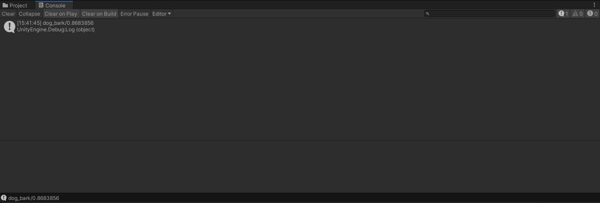

# ailia.audio samples

Use ailia.audio to perform MelSpectrum conversion of the input audio. Then classify the sound categories with the crnn model.

## Requirements

- ailia SDK 1.2.11 and later
- Unity 2019.4.36f1 and later

## Unity API

### Document

[ailia.audio C API](https://axinc-ai.github.io/ailia-sdk/api/cpp/en/ailia__audio_8h.html)

### Setup

Clone this repository and open the project in unity.

```
git clone git@github.com:axinc-ai/ailia-audio-samples.git
```

This repository does not include ailia libraries. So you must get SDK and license.

[Download ailia SDK trial version](https://ailia.jp/en/)

Import ailia and ailia.audio libraries to plugin folder using [copy_libraries.sh](copy_libraries.sh).

```
chmod +x copy_libraries.sh
./copy_libraries.sh
```

Place license file here.

```
- For Windows
 - Place ailia.lic in Assets/Plugins/x86_64/
- For Mac
 - Place ailia.lic in ~/Library/SHALO/
```

### Run

You can run it by opening the sample scene (unity/Assets/AiliaAudioSampleScene.unity) and pressing Run. The inference result is displayed on the console.



## C++ API

### Document

[ailia.audio C API](https://axinc-ai.github.io/ailia-sdk/api/cpp/en/ailia__audio_8h.html)

### Setup

Copy ailia and ailia.audio libraries to cpp folder.

### Make

Make with the following command.

```
cd cpp
export OSTYPE=Mac
make
```

### Run

Execute with the following command.

```
./crnn_audio_classification
```

The inference result is displayed on the console.

```
input shape 176 128 1 1 dims 4
output shape 10 1 1 1 dims 2
predict result
dog_bark 0.868386
```

## Python API

### Document

[ailia.audio Python API](https://axinc-ai.github.io/ailia-sdk/api/python/en/ailia.audio.html)

### Setup

Please clone ailia-models repository.

[crnn_audio_classification](https://github.com/axinc-ai/ailia-models/tree/master/audio_processing/crnn_audio_classification)

### Run

Execute with the following command.

```
python3 crnn_audio_classification.py --ailia_audio
```

The inference result is displayed on the console.

```
 INFO crnn_audio_classification.py (91) : input: 24965__www-bonson-ca__bigdogbarking-02.wav
 INFO crnn_audio_classification.py (98) : Start inference...
 INFO crnn_audio_classification.py (109) : dog_bark
 INFO crnn_audio_classification.py (110) : 0.8681702017784119
 INFO crnn_audio_classification.py (112) : Script finished successfully.
 ```

